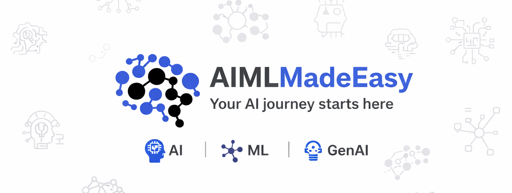

# AI ML & Generative AI Learning Series

## Channel

[AI ML Made Easy](https://www.youtube.com/@aimlmadeeasy)

## Overview

This repository contains a structured YouTube learning path for AI, ML, and Generative AI. The detailed curriculum is now grouped under `topics/`, with one folder per learning area so each section can be maintained independently.

Each session is intended to fit within `15-20 minutes` and help learners move from fundamentals to practical AI application building.

## Who This Series Is For

- Beginners starting from zero
- Developers moving into AI engineering
- Practitioners who want a structured path from fundamentals to applied GenAI

## Learning Goals

By the end of this series, learners should be able to:

- Understand AI, ML, DL, GenAI, and LLM fundamentals
- Run and experiment with local LLMs
- Build simple prompt-based and retrieval-based applications
- Understand when to use LangChain, LlamaIndex, LangGraph, and n8n
- Design chatbots, agents, workflows, and MCP-based integrations
- Move from conceptual knowledge to small real-world AI projects

## Topics

| Topic | Folder |
| --- | --- |
| Foundations | [topics/Foundations/README.md](topics/Foundations/README.md) |
